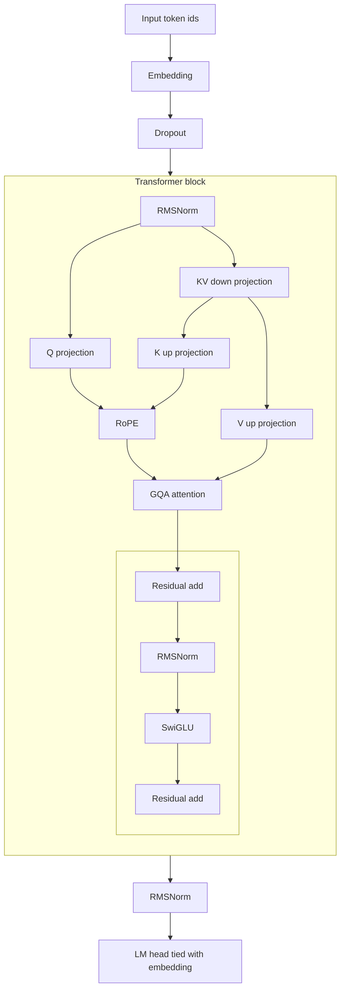

# Poetru-75M

## Overview

Poetru-75M is a Russian poetry SLM for generation, perplexity tracking, watermark detection, and author-space analysis on `IlyaGusev/stihi_ru`. Model and tokenizer are published the Hugging Face repository: `pymlex/poetru-75m`.

## Chinchilla Budget

This model has 75M parameters. With corpus token mass on the order of $4.55 \times 10^8$ and 3 epochs:

$$
T_{\mathrm{train}} \approx 3 \cdot 4.55 \times 10^8 \approx 1.37 \times 10^9.
$$

Compute-optimal scale with the Chinchilla laws taken in account:

$$
N_* \approx \frac{T_{\mathrm{train}}}{20} \approx 6.8 \times 10^7.
$$

Current checkpoint scale is $N = 74{,}899{,}072$.

## Architecture

| Component | Value |
| --- | ---: |
| Parameters | 74,899,072 |
| Context length | 512 |
| Layers | 12 |
| Hidden size | 640 |
| Q heads | 8 |
| KV heads | 4 |
| Head dim | 80 |
| Latent KV dim | 640 |
| FFN hidden | 1728 |
| Vocab size | 24,000 |

Architecture flow diagram:



RoPE angular frequencies:

$$
\theta_k = \theta_0^{-2k/d_h}, \quad \theta_0=10000, \quad d_h=80.
$$

RoPE rotation matrix for pair $(2k,2k+1)$ at position $m$:

$$
\begin{pmatrix}
q'_{2k}\\\\
q'_{2k+1}
\end{pmatrix}=\begin{pmatrix}
\cos(m\theta_k) & -\sin(m\theta_k)\\\\
\sin(m\theta_k) & \cos(m\theta_k)
\end{pmatrix}
\begin{pmatrix}
q_{2k}\\\\
q_{2k+1}
\end{pmatrix}.
$$

SwiGLU:

$$
\mathrm{SwiGLU}(x) = W_2\left(\mathrm{SiLU}(W_1x)\odot W_3x\right).
$$

## Digital Watermark

Generation bias parameters:

$$
\gamma = 0.25, \quad \delta = 2.0.
$$

Logit update:

$$
\ell'_t(v)=
\begin{cases}
\ell_t(v)+\delta, & v\in G_t\\
\ell_t(v), & v\notin G_t
\end{cases}
$$

Sampling distribution:

$$
p_t(v)=\frac{\exp(\ell'_t(v))}{\sum_{u\in\mathcal{V}}\exp(\ell'_t(u))}.
$$

Detection statistic:

$$
z=\frac{K-\gamma T}{\sqrt{T\gamma(1-\gamma)}}.
$$

## Dataset

Train source is `IlyaGusev/stihi_ru` with truncation to 512 BPE tokens per poem in training batches.

Token-length distribution summary:

| Statistic | Value |
| --- | ---: |
| count | 257,552 |
| mean | 171.89 |
| p25 | 92 |
| p50 | 135 |
| p75 | 196 |

Token-length histogram for the processed sample:


## Training Setup And Metrics

Hardware and schedule:

| Item | Value |
| --- | --- |
| CPU | Ryzen 9 9900X |
| GPU | RTX 5090 32GB |
| epochs | 3 |
| wall-clock | 18h 31m |
| optimiser steps | 240,246 |
| effective batch | 64 with `grad_accum_steps = 1` |
| validation cadence | every 1000 steps with `eval_batches = 200` |

Final optimisation row from `artifacts/logs/train_history.csv`:
- train CE window: 3.4006
- val CE: 3.3099
- LR: $3.0\times 10^{-5}$

Perplexity and watermark metrics:

| Metric | Value |
| --- | ---: |
| val loss | 3.2713 |
| perplexity | 26.3448 |
| watermark accuracy | 0.963 |
| watermark precision | 1.000 |
| watermark recall | 0.926 |
| watermark F1 | 0.9616 |
| watermark ROC-AUC | 0.9992 |

Loss curve in native scale. Train CE decreases from 6.1751 to 3.4006, validation CE from 5.3037 to 3.3099:


Chinchilla-style coordinates with $\log(\mathrm{step})$ and $\log\log L$:


Learning-rate trajectory for cosine decay with warmup:


Watermark separation quality from generated and real samples. The diagonal line on ROC is the random-guess baseline:


Confusion matrix at threshold $z \ge 4.0$:


Author-space PCA projection for generated and author centroids:


## 25M Pilot Experiment

Poetru-25M ran as a pilot to calibrate scaling.  
Current 75M configuration is the active line for stronger generalisation.

25M linear loss curve:


25M Chinchilla-style log-step and log-log-loss:


## Full Documentation

All operational commands, pipeline stages, resume flow, publish flow, and watermark configuration are documented in `docs/FRAMEWORK_GUIDE.md`.

## Inference In Colab

```python
!git clone https://github.com/pymlex/poetru.git
%cd /content/poetru
!pip install -q -r requirements.txt
import sys
sys.path.insert(0, "/content/poetru")

from pathlib import Path
import torch
from hub_utils import download_inference_artifacts
from bpe_tokenizer import ByteBPETokenizerWrapper
from checkpoint_utils import load_checkpoint
from configs import GenerationConfig
from trainer import generate_poem

root = Path("/content/poetru")
download_inference_artifacts(root)

device = torch.device("cuda" if torch.cuda.is_available() else "cpu")
tokenizer = ByteBPETokenizerWrapper.from_file(root / "artifacts/tokenizer/tokenizer.json")
model, _ = load_checkpoint(root / "artifacts/checkpoints/final.pt", device)
model.eval()
gen_cfg = GenerationConfig()
prompt = "Раз, два, три"
prompt_ids = tokenizer.encode(prompt, add_eos=False)

token_ids, _ = generate_poem(
    model,
    prompt_ids,
    eos_id=tokenizer.eos_id,
    gen_cfg=gen_cfg,
    device=device,
    apply_watermark=True,
)

text = tokenizer.decode(token_ids)
print(text)
```

## License

GPL-3.0, see `LICENSE`.
