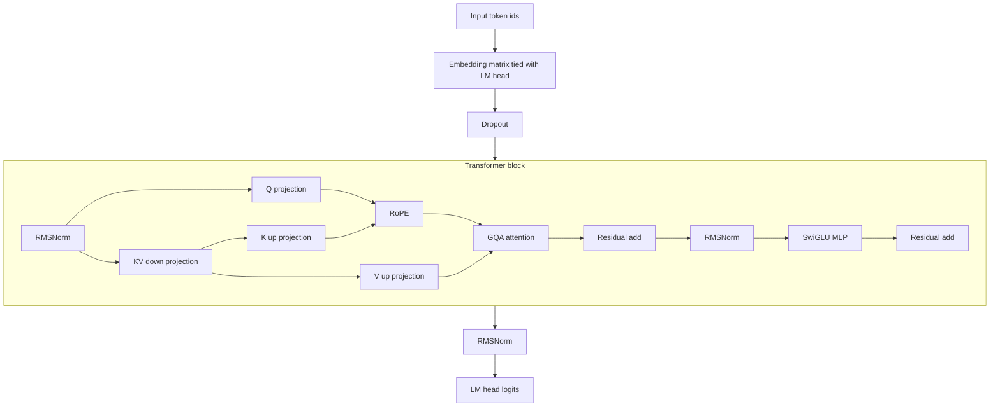

# Poetru-75M

Poetru-75M is a Russian poetry SLM trained from scratch on [`IlyaGusev/stihi_ru`](https://huggingface.co/datasets/IlyaGusev/stihi_ru) with ByteLevel BPE, RoPE, GQA with MLA-style latent KV, SwiGLU, RMSNorm, tied embeddings, and watermark-aware decoding.  
The Hugging Face target is a single model repository [`pymlex/poetru-75m`](https://huggingface.co/pymlex/poetru-75m), including `model.pt` and `tokenizer/tokenizer.json` in one bundle.

## Chinchilla Budget

Corpus size in BPE tokens is on the order of $4.55 \times 10^8$.  
With 3 epochs:

$$
T_{\mathrm{train}} \approx 3 \cdot 4.55 \times 10^8 \approx 1.37 \times 10^9.
$$

Chinchilla scaling with 20 tokens per parameter gives

$$
N_* \approx \frac{T_{\mathrm{train}}}{20} \approx 6.8 \times 10^7.
$$

Current checkpoint contains

$$
N \approx 7.4899072 \times 10^7
$$

trainable parameters from `artifacts/metrics/model_param_count.json`.

## Model Architecture

| Component | Value |
| --- | ---: |
| Parameters | 74,899,072 |
| Context length | 512 |
| Layers | 12 |
| Hidden size | 640 |
| Q heads | 8 |
| KV heads | 4 |
| Head dim | 80 |
| Latent KV dim | 640 |
| FFN hidden | 1728 |
| Vocab | 24,000 |



RoPE frequencies:

$$
\theta_k = \theta_0^{-2k/d_h}, \quad \theta_0 = 10000, \quad d_h = 80.
$$

SwiGLU block:

$$
\mathrm{SwiGLU}(x) = W_2\left(\mathrm{SiLU}(W_1x)\odot W_3x\right).
$$

## Digital Watermark

Generation applies a green-list logit bias with $(\gamma,\delta)=(0.25,2.0)$.

For step $t$, vocabulary $\mathcal{V}$ and green set $G_t\subset\mathcal{V}$:

$$
\ell'_t(v)=
\begin{cases}
\ell_t(v)+\delta, & v\in G_t\\
\ell_t(v), & v\notin G_t
\end{cases}
$$

$$
p_t(v)=\frac{\exp(\ell'_t(v))}{\sum_{u\in\mathcal{V}}\exp(\ell'_t(u))}.
$$

Detection with $T$ generated positions and green hit count $K$:

$$
z=\frac{K-\gamma T}{\sqrt{T\gamma(1-\gamma)}}.
$$

## Dataset

Source split is `train` from `IlyaGusev/stihi_ru`.  
Tokenisation uses ByteLevel BPE with truncation to 512 tokens per poem for train and validation batches.

Token-length statistics from `artifacts/metrics/token_length_stats.json`:

| Statistic | Value |
| --- | ---: |
| count | 257,552 |
| mean | 171.89 |
| p25 | 92 |
| p50 | 135 |
| p75 | 196 |


## Training Setup And Results

Run setup:
- CPU: Ryzen 9 9900X
- GPU: RTX 5090 32GB
- epochs: 3
- optimiser steps: 240,246
- wall-clock: 18h 31m
- effective batch: 64 with `grad_accum_steps = 1`
- validation loss evaluated every 1000 steps on `eval_batches = 200`

Final values from `artifacts/logs/train_history.csv`:

| Metric | Value |
| --- | ---: |
| final train CE window | 3.4006 |
| final validation CE | 3.3099 |
| final LR | $3.0 \times 10^{-5}$ |

Perplexity from `artifacts/metrics/perplexity.json`:

| Metric | Value |
| --- | ---: |
| validation loss | 3.2713 |
| perplexity | 26.3448 |

Watermark detection from `artifacts/metrics/watermark_metrics.json`:

| Metric | Value |
| --- | ---: |
| accuracy | 0.963 |
| precision | 1.000 |
| recall | 0.926 |
| F1 | 0.9616 |
| ROC-AUC | 0.9992 |


## Pilot 25M Experiment

Poetru-25M ran first as a scaling pilot and reached step 53,000 with monotonic improvement in train and validation CE.  
The current 75M checkpoint is the main branch target and shows stronger generalisation on the validation curve.


## Inference In Colab

```python
!git clone https://github.com/pymlex/poetru.git
%cd /content/poetru
!pip install -q -r requirements.txt
import sys
sys.path.insert(0, "/content/poetru")

from pathlib import Path
import torch
from hub_utils import download_inference_artifacts
from bpe_tokenizer import ByteBPETokenizerWrapper
from checkpoint_utils import load_checkpoint
from configs import GenerationConfig
from trainer import generate_poem

root = Path("/content/poetru")
download_inference_artifacts(root)

device = torch.device("cuda" if torch.cuda.is_available() else "cpu")
tokenizer = ByteBPETokenizerWrapper.from_file(root / "artifacts/tokenizer/tokenizer.json")
model, _ = load_checkpoint(root / "artifacts/checkpoints/final.pt", device)
model.eval()
gen_cfg = GenerationConfig()
prompt = "Раз, два, три"
prompt_ids = tokenizer.encode(prompt, add_eos=False)

token_ids, _ = generate_poem(
    model,
    prompt_ids,
    eos_id=tokenizer.eos_id,
    gen_cfg=gen_cfg,
    device=device,
    apply_watermark=True,
)

text = tokenizer.decode(token_ids)
print(text)
```

## Core Commands

```bash
python main.py train_tokenizer --root .
python main.py train_model --root .
python scripts/generate_poems.py --root . --count 1000
python main.py perplexity --root .
python scripts/evaluate_watermark.py
python main.py author_pca --root .
python main.py publish --root .
```

## License

GPL-3.0, see `LICENSE`.
