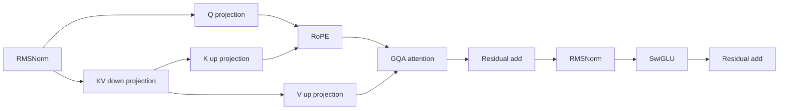
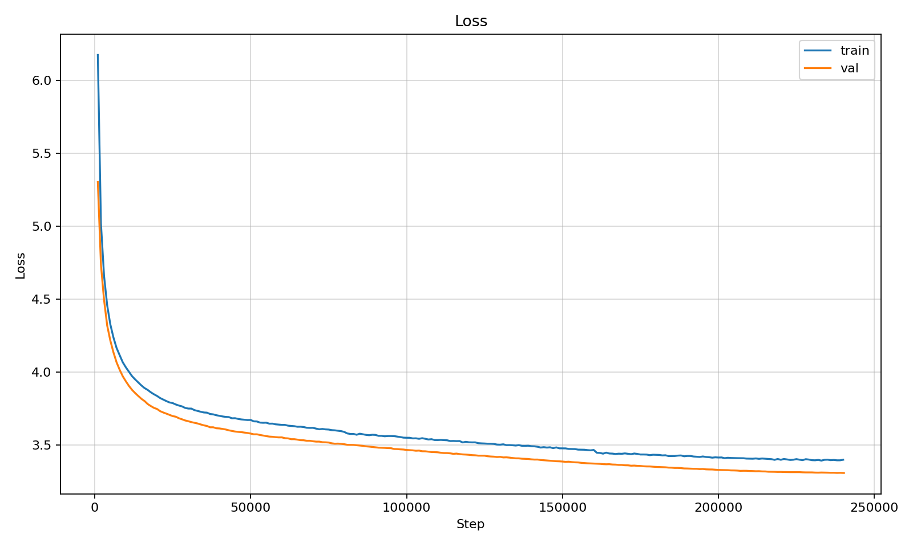
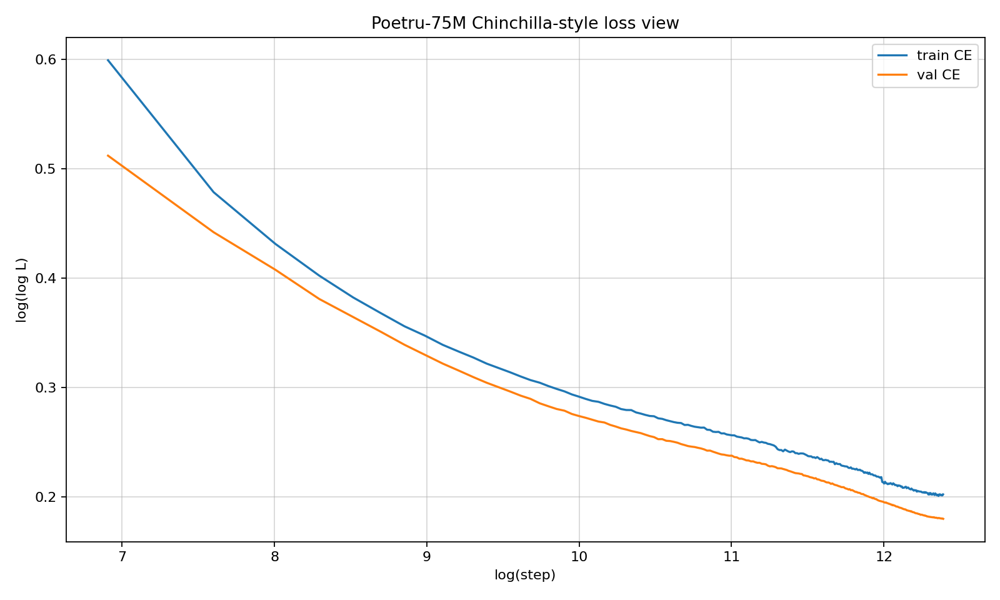
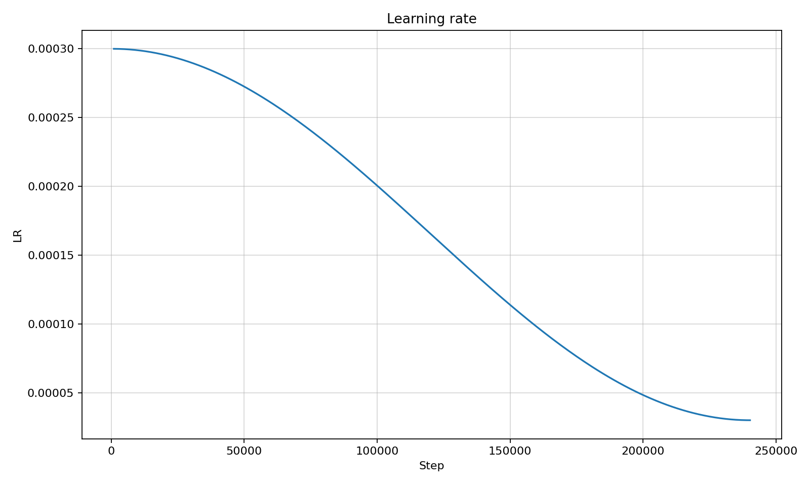
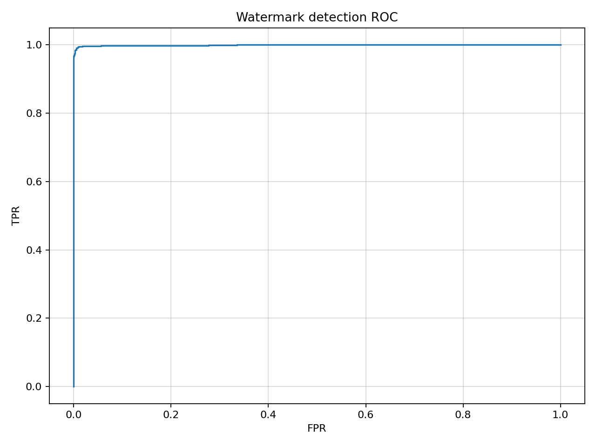
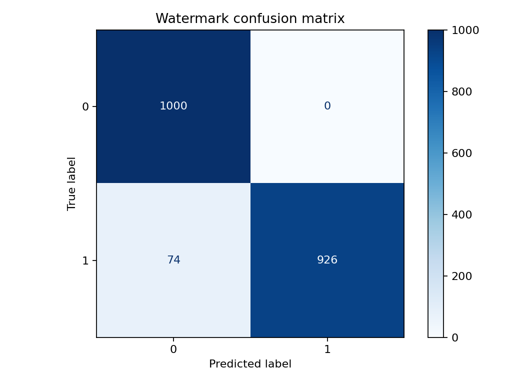
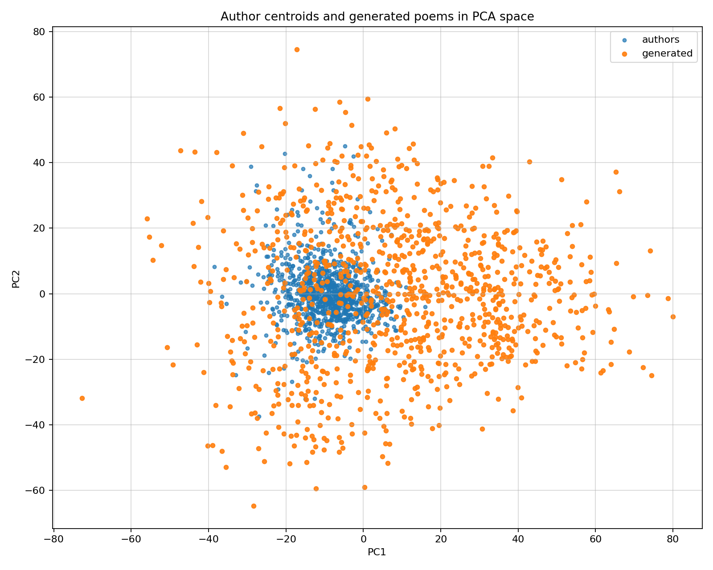
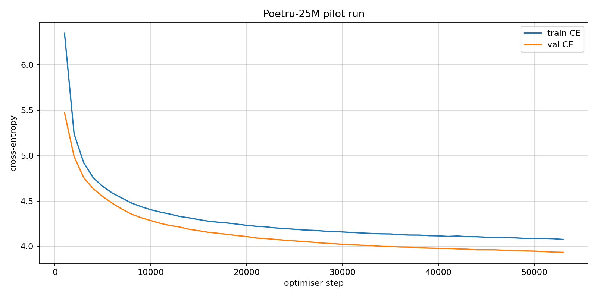
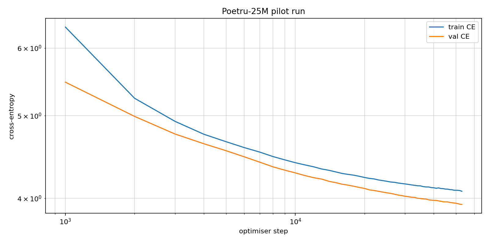

# Poetru-75M

## Overview

Poetru-75M is a Russian SLM for poem generation trained on 2 GB of Russian poetry, presented in the `IlyaGusev/stihi_ru` [dataset](https://huggingface.co/datasets/IlyaGusev/stihi_ru). We implement it from scratch with optimisation techniques. Inference includes digital watermarking mode. The model and tokenizer are published in the Hugging Face [repository](https://huggingface.co/pymlex/poetru-75m).

## Chinchilla Budget

This model has 75M parameters. With corpus token mass on the order of $4.55 \times 10^8$ and 3 epochs:

$$
T_{\mathrm{train}} \approx 3 \cdot 4.55 \times 10^8 \approx 1.37 \times 10^9.
$$

Compute-optimal scale with the Chinchilla laws taken in account:

$$
N_* \approx \frac{T_{\mathrm{train}}}{20} \approx 6.8 \times 10^7.
$$

Current checkpoint scale is $N = 74{,}899{,}072$.

## Architecture

| Component | Value |
| --- | ---: |
| Parameters | 74,899,072 |
| Context length | 512 |
| Layers | 12 |
| Hidden size | 640 |
| Q heads | 8 |
| KV heads | 4 |
| Head dim | 80 |
| Latent KV dim | 640 |
| FFN hidden | 1728 |
| Vocab size | 24,000 |

### Architecture flow diagram


### Transformer block



### RoPE

RoPE is used to encode relative position directly in attention space without learned absolute position embeddings. This keeps extrapolation to longer rhythm patterns more stable and preserves translation structure in the query-key dot product. The formulation follows Rotary Position Embedding from RoFormer.

RoPE angular frequencies:

$$
\theta_k = \theta_0^{-2k/d_h}, \quad \theta_0=10000, \quad d_h=80.
$$

RoPE rotation matrix for pair $(2k,2k+1)$ at position $m$:

$$
\begin{pmatrix}
q'_{2k}\\\\
q'_{2k+1}
\end{pmatrix}=\begin{pmatrix}
\cos(m\theta_k) & -\sin(m\theta_k)\\\\
\sin(m\theta_k) & \cos(m\theta_k)
\end{pmatrix}
\begin{pmatrix}
q_{2k}\\\\
q_{2k+1}
\end{pmatrix}.
$$

### SwiGLU activation
SwiGLU is used in the feed-forward block because the gated multiplicative path preserves stronger token-selective dynamics than a plain two-layer MLP and consistently improves language modelling quality at the same width.

SwiGLU definition:

$$
\mathrm{SwiGLU}(x) = W_2\left(\mathrm{SiLU}(W_1x)\odot W_3x\right).
$$

### GQA

GQA is used to reduce the number of key and value heads while keeping the number of query heads larger. The model has 8 query heads and 4 KV heads, together with head dimension 80 and latent KV dimension 640. If there are $H_q$ query heads and $H_{kv}$ key-value heads, then each group of query heads shares one key-value head. The group size is

$$
g = \frac{H_q}{H_{kv}}.
$$

For token representation $x$, the projections are

$$
Q = xW_Q,\qquad K = xW_K,\qquad V = xW_V.
$$

The query tensor is split into $H_q$ heads, while the key and value tensors are split into only $H_{kv}$ heads. Each key-value head is then shared across the corresponding group of query heads:

$$
\tilde K = \mathrm{repeat}(K, g), \qquad \tilde V = \mathrm{repeat}(V, g).
$$

The attention output for head $h$ is

$$
\mathrm{Attn}(Q_h, \tilde K_h, \tilde V_h)=\mathrm{softmax}\!\left(\frac{Q_h \tilde K_h^{\top}}{\sqrt{d_h}}\right)\tilde V_h.
$$

## Digital Watermark

Digital watermarking follows the soft green-list construction from [Kirchenbauer et al., 2023](https://arxiv.org/abs/2301.10226). For each decoding step, a pseudo-random subset of vocabulary ids receives a positive logit bias, so generated text carries a detectable statistical signature while preserving fluent sampling.

Generation bias parameters:

$$
\gamma = 0.25, \quad \delta = 2.0.
$$

Logit update:

$$
\ell'_t(v)=
\begin{cases}
\ell_t(v)+\delta, & v\in G_t\\
\ell_t(v), & v\notin G_t
\end{cases}
$$

Sampling distribution:

$$
p_t(v)=\frac{\exp(\ell'_t(v))}{\sum_{u\in\mathcal{V}}\exp(\ell'_t(u))}.
$$

Detection statistic:

$$
z=\frac{K-\gamma T}{\sqrt{T\gamma(1-\gamma)}}.
$$

## Dataset

Train source is `IlyaGusev/stihi_ru` with truncation to 512 BPE tokens per poem in training batches. Token-length distribution summary:

| Statistic | Value |
| --- | ---: |
| count | 257,552 |
| mean | 171.89 |
| p25 | 92 |
| p50 | 135 |
| p75 | 196 |

Token-length histogram for the processed sample:


## Training Setup And Metrics

Hardware and schedule:

| Item | Value |
| --- | --- |
| CPU | Ryzen 9 9900X |
| GPU | RTX 5090 32GB |
| epochs | 3 |
| wall-clock | 18h 31m |
| optimiser steps | 240,246 |
| effective batch | 64 with `grad_accum_steps = 1` |
| validation cadence | every 1000 steps with `eval_batches = 200` |

Final optimisation state from `artifacts/logs/train_history.csv`:

| Quantity | Value |
| --- | ---: |
| train CE window | 3.4006 |
| val CE | 3.3099 |
| LR | $3.0\times 10^{-5}$ |

Perplexity and watermark metrics:

| Metric | Value |
| --- | ---: |
| val loss | 3.2713 |
| perplexity | 26.3448 |
| watermark accuracy | 0.963 |
| watermark precision | 1.000 |
| watermark recall | 0.926 |
| watermark F1 | 0.9616 |
| watermark ROC-AUC | 0.9992 |

Loss curve in native scale. Train CE decreases from 6.1751 to 3.4006, validation CE from 5.3037 to 3.3099:



Chinchilla-style coordinates with $\log(\mathrm{step})$ and $\log\log L$:



Learning-rate trajectory for cosine decay with warmup:



Watermark separation quality from generated and real samples. The diagonal line on ROC is the random-guess baseline:



Confusion matrix at threshold $z \ge 4.0$:



Author-space PCA projection for generated and author centroids:



Statistical difference between author and generated embedding distributions was measured with a permutation test over mean embedding shift:

| Quantity | Value |
| --- | ---: |
| author samples | 1000 |
| generated samples | 1000 |
| mean-embedding distance | 22.3428 |
| p-value | 0.00020 |

## 25M Pilot Experiment

Poetru-25M ran as a pilot to calibrate scaling. Current 75M configuration showed 3 times better generalisation, surpassing the compact version.

25M linear loss curve:



25M Chinchilla-style log-step and log-log-loss:



## Full Documentation

All operational commands, pipeline stages, resume flow, publish flow, and watermark configuration are documented in `docs/FRAMEWORK_GUIDE.md`.

## Inference In Colab

Install the dependencies. 

```python
!git clone https://github.com/pymlex/poetru.git
%cd /content/poetru
!pip install -q -r requirements.txt
import sys
sys.path.insert(0, "/content/poetru")
```

Load and configure the model and its tokenizer.

```python
from pathlib import Path
import torch
from hub_utils import download_inference_artifacts
from bpe_tokenizer import ByteBPETokenizerWrapper
from checkpoint_utils import load_checkpoint
from configs import GenerationConfig
from trainer import generate_poem

root = Path("/content/poetru")
download_inference_artifacts(root)

device = torch.device("cuda" if torch.cuda.is_available() else "cpu")
tokenizer = ByteBPETokenizerWrapper.from_file(root / "artifacts/tokenizer/tokenizer.json")
model, _ = load_checkpoint(root / "artifacts/checkpoints/final.pt", device)
model.eval()
gen_cfg = GenerationConfig()
```

Generate a poem based on the provided beginning.

```python
prompt = "Раз, два, три"
prompt_ids = tokenizer.encode(prompt, add_eos=False)

token_ids, _ = generate_poem(
    model,
    prompt_ids,
    eos_id=tokenizer.eos_id,
    gen_cfg=gen_cfg,
    device=device,
    apply_watermark=True,
)

text = tokenizer.decode(token_ids)
print(text)
```

## Citation

If you found this project useful, please cite it as:

```bibtex
@software{zyukov2026poetru75,
  author  = {Zyukov, Alex},
  title   = {{Poetru-75M}: A Russian Poetry Language Model},
  year    = {2026},
  url     = {https://github.com/pymlex/poetru},
  version = {1.0},
  note    = {Hugging Face model pymlex/poetru-75m}
}
```

The code is under GPL-3.0 license.

## References

```bibtex
@misc{su2021roformer,
  title         = {{RoFormer}: Enhanced Transformer with Rotary Position Embedding},
  author        = {Jianlin Su and Yu Lu and Shengfeng Pan and Ahmed Murtadha and Bo Wen and Yunfeng Liu},
  year          = {2021},
  eprint        = {2104.09864},
  archivePrefix = {arXiv},
  primaryClass  = {cs.CL},
  url           = {https://arxiv.org/abs/2104.09864}
}

@misc{kirchenbauer2023watermark,
  title         = {A Watermark for Large Language Models},
  author        = {John Kirchenbauer and Jonas Geiping and Yuxin Wen and Jonathan Katz and Ian Miers and Tom Goldstein},
  year          = {2023},
  eprint        = {2301.10226},
  archivePrefix = {arXiv},
  primaryClass  = {cs.LG},
  url           = {https://arxiv.org/abs/2301.10226}
}

@misc{hoffmann2022chinchilla,
  title         = {Training Compute-Optimal Large Language Models},
  author        = {Jordan Hoffmann and Sebastian Borgeaud and Arthur Mensch and Elena Buchatskaya and Trevor Cai and Eliza Rutherford and Diego de Las Casas and Lisa Anne Hendricks and Johannes Welbl and Aidan Clark and Tom Hennigan and Eric Noland and Katie Millican and George van den Driessche and Bogdan Damoc and Aurelia Guy and Simon Osindero and Karen Simonyan and Erich Elsen and Jack W. Rae and Oriol Vinyals and Laurent Sifre},
  year          = {2022},
  eprint        = {2203.15556},
  archivePrefix = {arXiv},
  primaryClass  = {cs.CL},
  url           = {https://arxiv.org/abs/2203.15556}
}

@misc{ainslie2023gqa,
  title         = {GQA: Training Generalized Multi-Query Transformer Models from Multi-Head Checkpoints},
  author        = {Joshua Ainslie and James Lee-Thorp and Michiel de Jong and Yury Zemlyanskiy and Federico Lebr{\'o}n and Sumit Sanghai},
  year          = {2023},
  eprint        = {2305.13245},
  archivePrefix = {arXiv},
  primaryClass  = {cs.CL},
  url           = {https://arxiv.org/abs/2305.13245}
}
```
