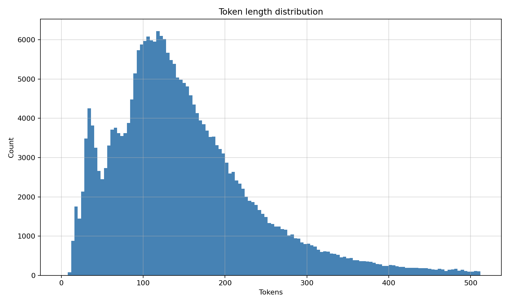

# poetru-25m

## Overview

This repository trains a compact Russian **causal language model** from scratch on the public poetry corpus [`IlyaGusev/stihi_ru`](https://huggingface.co/datasets/IlyaGusev/stihi_ru). The goal is plain **next-token prediction** on full poem texts, then **open-vocabulary generation** with reproducible inference utilities, **GPU telemetry**, and **digital watermarking** at decode time so outputs can be audited without sharing model weights.

The stack is **pure PyTorch**. It is not a Hugging Face `transformers` Trainer project. The tokenizer is **ByteLevel BPE** trained with the Rust-backed [`tokenizers`](https://github.com/huggingface/tokenizers) library. The backbone is a decoder-only Transformer with **RoPE**, **Grouped-Query Attention (GQA)** with **multi-head latent style KV compression (MLA-style)**, **SwiGLU** feed-forward layers, **RMSNorm**, **pre-norm residuals**, **dropout**, and **tied token embeddings**.

Published checkpoints and artefacts are mirrored on the Hub under [`pymlex/poetru-25m`](https://huggingface.co/pymlex/poetru-25m). A parallel tokenizer-only upload target is configurable through `.env`.

## Scaling rationale

[Hoffmann et al., Training Compute-Optimal Large Language Models](https://arxiv.org/abs/2203.15556), usually referred to as **Chinchilla**, reports approximate compute-optimal token counts on the order of **20 tokens per parameter** for the sizes they explored. Your poetry corpus yields on the rough order of **455 million ByteLevel-BPE tokens** when the tokenizer is saturated to 24 k merges. Seeing that volume about **2.5 times** during optimisation lands near **1.1 billion training tokens**, which is the same order of magnitude as **20 times 25 million parameters**. The width and depth in `configs.py` are therefore chosen so the **non-embedding parameter mass** sits near **25 million trainable parameters** while embeddings stay at **24 k times 384** with **weight tying** on the output projection.

The exact trainable count after you run `train_model` is written to `artifacts/metrics/model_param_count.json` so you can verify it on your machine without hand-waving.

## Dataset

The source split is the public `train` partition of [`IlyaGusev/stihi_ru`](https://huggingface.co/datasets/IlyaGusev/stihi_ru). Each row includes at least the following fields that this project touches:

* `id`
* `text`
* `title`
* `genre`
* `topic`
* `author`

**Preprocessing for language modelling**

* Rows with empty `text` are dropped.
* No instruction template is applied. Each poem is tokenised as raw UTF-8 text and finished with `[EOS]` inside the tokenizer JSON.
* For training and validation, poems longer than **512 tokens** after BPE are **truncated** to the prefix of that length inside `PoetryTokenDataset`.

**Held-out poetry split**

Inside `train_model`, the filtered list is shuffled once with seed `3407`, then partitioned into:

* **Train:** 99.5 percent of surviving rows
* **Validation:** 0.5 percent of surviving rows

This is deliberately small validation mass because **5.1 million poems** already overload I/O relative to GPU step time.

**Lengths**

Rough public statistics report **about 5.15 million poems** with **character-length** summaries such as median **464** chars and quartiles near **315** and **673** chars on plain string length prior to tokenizer training. Those numbers are raw bytes of the `text` field, **not** BPE lengths.

After you run `train_tokenizer`, two artefacts land under `artifacts/metrics`:

* **Histogram:** `artifacts/metrics/token_length_hist.png` capped on the horizontal axis by the configured `max_seq_len` (512 tokens)
* **JSON summary:** `artifacts/metrics/token_length_stats.json` with count, mean, standard deviation, min, quartiles, max

Embed the histogram in this README locally like this once the PNG exists:

```markdown

```

## ByteLevel BPE tokenizer

Training reads the poetry stream once through `datasets.load_dataset(..., streaming=True)` and feeds the iterator into `tokenizer.train_from_iterator`. Settings live in `TokenizerTrainConfig` inside `configs.py`:

* vocabulary size **24 000**, including `[PAD]`, `[EOS]`, `[UNK]`
* `min_frequency = 2` for merge retention
* `dataset_sample_fraction = 1.0` uses the full stream

The runtime wrapper is `ByteBPETokenizerWrapper` in `bpe_tokenizer.py`. It exposes `pad_id`, `eos_id`, `unk_id` for padding and generation.

## Model architecture

The module `model.py` implements `PoetruCausalLM`. The table below summarises `TransformerConfig` defaults. **Headings here use plain text on purpose** because GitHub does not render mathematics inside Markdown heading lines.

| Block | Value |
| --- | ---: |
| Vocabulary size | 24 000 |
| Context length | 512 |
| Hidden size | 384 |
| Layers | 5 |
| Query heads | 8 |
| KV heads | 4 |
| Head size | 48 |
| MLA latent width | 384 |
| SwiGLU intermediate | 1 024 |
| Dropout | 0.1 |
| RoPE base theta | 10 000 |
| Output head | linear, **tied** to input embeddings |

### Rotary position embeddings

RoPE is applied to **queries and keys** after head projection. With head dimension 48, index pairs are rotated by position-dependent angles. Let `k` run from `0` to `d_h/2 - 1` with `d_h = 48`. Frequencies use the usual inverse-power schedule with base `theta_0 = 10 000`:

$$
\theta_k = \theta_0^{-2k/d_h}
$$

For token position `m` and pair index `k`, the two-dimensional rotation is

$$
\begin{pmatrix} q'_{2k} \\ q'_{2k+1} \end{pmatrix}
=
\begin{pmatrix} \cos(m\theta_k) & -\sin(m\theta_k) \\ \sin(m\theta_k) & \cos(m\theta_k) \end{pmatrix}
\begin{pmatrix} q_{2k} \\ q_{2k+1} \end{pmatrix}
$$

The same transform is applied to key rows before the scaled dot product.

### MLA-style KV path and GQA

Each layer forms **queries** with eight heads. **Keys and values** are produced from a **shared low-rank bottleneck** `c_t = W_{\mathrm{down}} h_t` in `R^{384}`, then expanded with `W_{k}` and `W_{v}` into **four** physical KV heads. Each KV head is **repeated twice** with `torch.repeat_interleave` so every query head still receives a key and value slice. This matches the **GQA** pattern with **KV reuse** and **cache savings** at inference time.

### SwiGLU feed-forward

Let `x` be a hidden vector at one time step. With intermediate width 1024, the block is

$$
\mathrm{SwiGLU}(x) = W_{\mathrm{down}}\bigl(\mathrm{SiLU}(W_{\mathrm{gate}} x) \odot W_{\mathrm{up}} x\bigr)
$$

where `SiLU` is the sigmoid-weighted linear unit.

## Training

### Reference hardware

The configuration was written for a **single-GPU** workstation profile:

* **GPU:** NVIDIA GeForce RTX 5090 class device with **bfloat16** autocast when CUDA exposes BF16
* **CPU:** AMD Ryzen 9 9950X class host for dataloader workers
* **System RAM:** 60 GB or more because the **non-streaming** `train_model` path materialises all cleaned poem strings into Python lists before building `DataLoader` objects

If you train on a smaller machine, reduce `micro_batch_size`, `num_workers`, or switch the data pipeline to a streaming dataset. That refactor is not bundled here.

### Optimiser and schedule

`trainer.py` wires **AdamW** with decoupled weight decay and a custom **cosine decay** schedule that starts after a **linear warmup** whose length is `warmup_ratio` times the total optimisation steps. Gradient norms are clipped. Training steps are derived from `len(train_loader) * num_epochs` with **gradient accumulation** counting as micro-steps before each optimiser update.

| Hyperparameter | Value |
| --- | ---: |
| micro batch size | 16 |
| gradient accumulation | 4 |
| epochs | 2.5 |
| learning rate | `3e-4` |
| weight decay | `0.1` |
| warmup ratio | `0.03` |
| max grad norm | `1.0` |
| Adam `betas` | `(0.9, 0.95)` |
| Adam `eps` | `1e-8` |
| precision | `bfloat16` autocast on CUDA when available |
| log every | 50 steps |
| checkpoint every | 2 000 steps |
| validation batches per eval | 200 |

**GPU telemetry** from NVML is appended to `artifacts/logs/train_history.csv` as utilisation percent and used or total VRAM in megabytes on each logging row.

You can plot `train_history.csv` with any notebook. A minimal helper sketch:

```python
import pandas as pd
import matplotlib.pyplot as plt

df = pd.read_csv("artifacts/logs/train_history.csv")
plt.figure(figsize=(10, 5))
plt.plot(df["step"], df["loss"], label="train")
plt.plot(df["step"], df["val_loss"], label="val")
plt.xlabel("step")
plt.ylabel("loss")
plt.grid(alpha=0.5)
plt.legend()
plt.savefig("artifacts/metrics/custom_loss_curve.png", dpi=160)
```

Replace filenames if you duplicate runs.

## Digital watermark at generation

Watermarking follows the **soft green-list** construction of **Kirchenbauer, Geiping, Wen, Katz, Miers, Goldstein**, *[A Watermark for Large Language Models](https://arxiv.org/abs/2301.10226)*, ICML **2023**. Implementation lives in `watermark.py`.

**Generation bias**

Given previous token ID `s_{t-1}`, a deterministic pseudo-random subset `G_t` of the vocabulary receives logit increments `delta` before softmax. Your defaults are **`gamma = 0.25`** of the vocabulary mass in the green list and **`delta = 2.0`**.

**Detection**

`detect_watermark` counts how often the realised next token lies in the green list predicted from the previous token, then forms a **one-sided normal z-score** under the null of fair coin draws with hit probability `gamma`. Large positive `z` supports the hypothesis **machine-generated under this scheme**.

**Evaluation script**

`scripts/evaluate_watermark.py` loads `artifacts/generated_poems.jsonl`, samples the same number of real poems, scores each sequence, and writes `artifacts/metrics/watermark_metrics.json` plus `watermark_roc.png` and `watermark_scores.csv`.

## Author embedding PCA

`main.py author_pca` scans the streaming dataset, keeps authors with at least **120** poems, stores up to **48** poems per author, caps to **200** authors by popularity, mean-pools final-layer hidden states per poem with `mean_pool_hidden`, averages per author, runs **PCA to two components**, and overlays **200 generated poems** from `artifacts/generated_poems.jsonl`. Outputs:

* `artifacts/metrics/author_embeddings.npz`
* `artifacts/metrics/generated_embeddings.npz`
* `artifacts/metrics/author_pca.png`

Constants are in `AuthorPCConfig` inside `configs.py`.

## Repository layout

| Path | Role |
| --- | --- |
| `configs.py` | frozen dataclasses for model, train, tokenizer, generation, author study |
| `model.py` | `PoetruCausalLM`, attention, MLP, RMSNorm |
| `bpe_tokenizer.py` | wrapper around `tokenizers` JSON |
| `data_utils.py` | dataset IO, collate, histogram export |
| `loss_utils.py` | masked next-token cross entropy |
| `lr_schedule.py` | cosine with linear warmup |
| `trainer.py` | optimisation loop, generation helper, mean pooling |
| `watermark.py` | bias, sampling hook, z-test |
| `checkpoint_utils.py` | save and load `torch` checkpoints |
| `hub_utils.py` | optional Hub upload bundle |
| `main.py` | CLI entry for the full pipeline |
| `pydantic_models.py` | `EnvSettings` for Hub tokens and repo ids |
| `notebooks/poetru.ipynb` | theory markdown plus cells |
| `scripts/` | push helpers and standalone evaluation entry points |

## Environment and secrets

```bash
python -m venv .venv
source .venv/bin/activate   # Windows: .venv\Scripts\activate
pip install -r requirements.txt
cp .env.example .env
```

Populate `.env` with **only** secrets and Hub routing:

| Variable | Meaning |
| --- | --- |
| `HF_TOKEN` | Hugging Face access token with write scope to your model namespace |
| `HF_MODEL_REPO` | target model repo id, default `pymlex/poetru-25m` |
| `HF_TOKENIZER_REPO` | tokenizer-only repo id used by `publish` |
| `GITHUB_TOKEN` | optional for CI or scripted GitHub REST, not consumed by core training |

The file `.env` stays **outside** Git through `.gitignore`.

## Commands

Tokenizer only:

```bash
python main.py train_tokenizer --root .
```

Training only:

```bash
python main.py train_model --root .
```

Deterministic regeneration of `200` watermarked poems and JSONL dump:

```bash
python scripts/generate_poems.py --root . --count 200
```

**Perplexity** on a small subsample and capped batch count:

```bash
python main.py perplexity --root .
```

Watermark ROC and classification metrics:

```bash
python scripts/evaluate_watermark.py
```

Author PCA figure:

```bash
python main.py author_pca --root .
```

Hub upload of tokenizer plus checkpoint bundle:

```bash
python main.py publish --root .
```

End-to-end:

```bash
python main.py all --root .
```

### Git and Hub shell helpers

```bash
bash scripts/push_github.sh "Describe your change"
bash scripts/push_hub.sh publish
```

On Windows without Bash, `scripts/push_github.ps1` mirrors the Git steps.

## Inference from a local checkpoint

First cell loads weights and tokenizer.

```python
from pathlib import Path
import torch
from bpe_tokenizer import ByteBPETokenizerWrapper
from checkpoint_utils import load_checkpoint
from configs import GenerationConfig
from trainer import generate_poem

root = Path(".").resolve()
device = torch.device("cuda" if torch.cuda.is_available() else "cpu")

tokenizer = ByteBPETokenizerWrapper.from_file(root / "artifacts/tokenizer/tokenizer.json")
model, _ = load_checkpoint(root / "artifacts/checkpoints/final.pt", device)
model.eval()

gen_cfg = GenerationConfig()
```

Second cell samples a continuation with **watermark bias enabled**.

```python
prompt = "В тишине ночной"
prompt_ids = tokenizer.encode(prompt, add_eos=False)

token_ids, _ = generate_poem(
    model,
    prompt_ids,
    eos_id=tokenizer.eos_id,
    gen_cfg=gen_cfg,
    device=device,
    apply_watermark=True,
)

text = tokenizer.decode(token_ids)
print(text)
```

To **audit** a string you already tokenised:

```python
from watermark import WatermarkConfig, detect_watermark
from configs import TokenizerTrainConfig

vocab = TokenizerTrainConfig().vocab_size
wm_cfg = WatermarkConfig(gamma=0.25, delta=2.0)
ids = tokenizer.encode(text, add_eos=True)
print(detect_watermark(ids, vocab, wm_cfg))
```

## Metrics you should paste back into this README after a run

**Perplexity**

`artifacts/metrics/perplexity.json` carries `val_loss` and `perplexity`.

| Quantity | Fill after run |
| --- | ---: |
| validation loss | TBD |
| perplexity exp(loss) | TBD |

**Watermark detector operating point**

`artifacts/metrics/watermark_metrics.json` stores accuracy, precision, recall, `f1`, and `roc_auc` at threshold `z >= 4.0`.

| Metric | Fill after run |
| --- | ---: |
| accuracy | TBD |
| precision | TBD |
| recall | TBD |
| F1 | TBD |
| ROC-AUC | TBD |

**Figures**

* `artifacts/metrics/token_length_hist.png`
* optional custom loss PNG from CSV plotting
* `artifacts/metrics/watermark_roc.png`
* `artifacts/metrics/author_pca.png`

## Inference without training

Downloading a Hub snapshot mirrors the inference cells above once you unpack `tokenizer.json` next to `final.pt`.

## Licensing and citation

Training code is **GPL-3.0**, see `LICENSE`.

If you use the watermark method academically, cite the original paper:

```bibtex
@inproceedings{kirchenbauer2023watermark,
  title     = {A Watermark for Large Language Models},
  author    = {Kirchenbauer, John and Geiping, Jonas and Wen, Yuxin and Katz, Jonathan and Miers, Ian and Goldstein, Tom},
  booktitle = {International Conference on Machine Learning},
  year      = {2023}
}
```

For compute scaling discussion, cite Chinchilla:

```bibtex
@article{hoffmann2022chinchilla,
  title   = {Training Compute-Optimal Large Language Models},
  author  = {Hoffmann, Jordan and Borgeaud, Sebastian and others},
  journal = {arXiv preprint arXiv:2203.15556},
  year    = {2022}
}
```

## References

* Dataset hub card: [`IlyaGusev/stihi_ru`](https://huggingface.co/datasets/IlyaGusev/stihi_ru)
* Watermark paper: [`arXiv:2301.10226`](https://arxiv.org/abs/2301.10226)
* Chinchilla paper: [`arXiv:2203.15556`](https://arxiv.org/abs/2203.15556)
